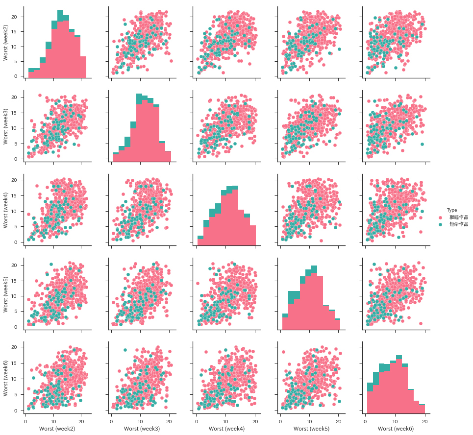
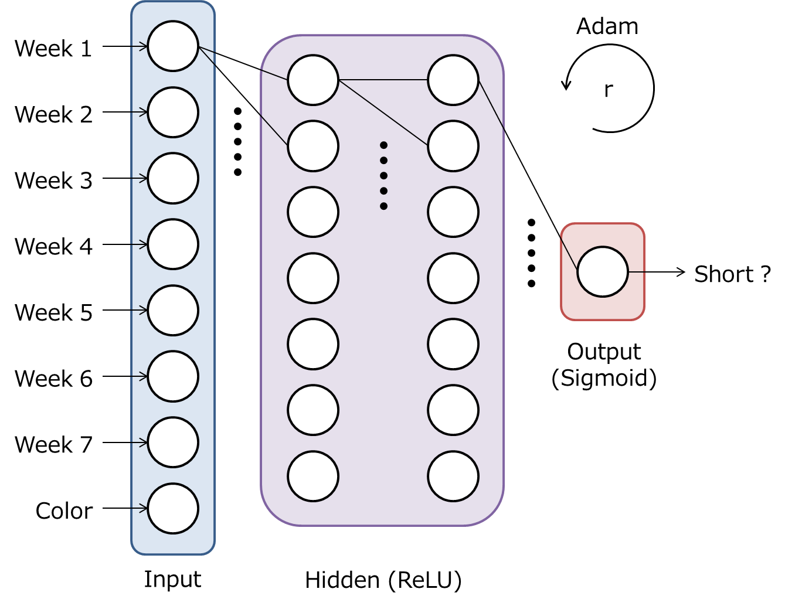
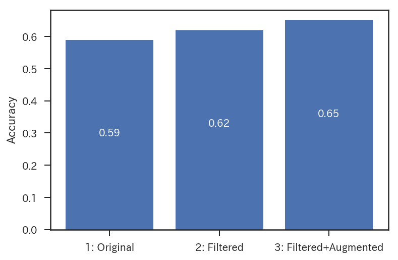

# predicting-comic-end
This repository includes python codes and jupyter notebooks to predict the end of comic serialized in [weekly shonen jump](https://www.shonenjump.com).

## Introduction

[Weekly shonen jump](https://www.shonenjump.com) is one of the most popular *manga* magazine in Japan. 
[Dragon Ball](https://en.wikipedia.org/wiki/Dragon_Ball), [Slum Dunk](https://en.wikipedia.org/wiki/Slam_Dunk_(manga)), [Naruto](https://en.wikipedia.org/wiki/Naruto), [Bleach](https://en.wikipedia.org/wiki/Bleach_(manga)), and so on, were serialized in this weekly magazine. 
[One Piece](https://en.wikipedia.org/wiki/One_Piece), which was awarded a *Guiness World Record* for the most copies published for the same comic book series by a single author, is being serialized, too.

Empirically, the order of comics in weekly shonen jump seem to be related to their popularity: the more popular a comic is, the former it is in the magazine.
Unpopular comics can be closed even if they have been serialized for less than 10 weeks. 
Our goal is to predict the end of comic serialized in the magazine from the order of comics.
We obtain the indexes of the magazine for about 46 years from [Media Art Database](https://mediaarts-db.bunka.go.jp/?utf8=%E2%9C%93&locale=en).
We build a neural network with tensorflow.

## Environment

```
conda env create -f env.yml
```

You have to import `comic.py`.

```python
import comic
```


## Obtain data 


We obtain the indexes of the magazine for about 46 years from [Media Art Database](https://mediaarts-db.bunka.go.jp/?utf8=%E2%9C%93&locale=en).
We save `wj-api.json` to `./data` directry.

```python
magazines = comic.search_magazine()
comic.save_data(magazines)
```

For detail, please refer to the following jupyter notebook:

```bash
jupyter notebook 0_obtain_comic_data_j.ipynb

```

## Analysis

`ComicAnalyzer` helps you to analyze the order of comic titles.

```python
wj = comic.ComicAnalyzer()
```

For example, you can plot the order of short titles in the first 10 weeks, where short title is a comic title which ends within 20 weeks.

```python
import matplotlib.pyplot as plt

for title in wj.short_end_titles[-10:]:
    plt.plot(wj.extract_item(title)[:10], label=title[:6])
plt.xlabel('Week')
plt.ylabel('Worst')
plt.ylim(0,22)
plt.legend()
plt.show()
```


Pair plot helps you to visualize the relationship between short titles and long titles.

```python
import pandas as pd

end_data = pd.DataFrame(
    [[wj.extract_item(title)[1] + np.random.randn() * .3,
      wj.extract_item(title)[2] + np.random.randn() * .3,
      wj.extract_item(title)[3] + np.random.randn() * .3,
      wj.extract_item(title)[4] + np.random.randn() * .3,
      wj.extract_item(title)[5] + np.random.randn() * .3,
      '短命作品' if title in wj.short_end_titles else '継続作品']
     for title in wj.end_titles])
plt.show()

``` 



For detail, please refer to the following jupyter notebook:

```bash
jupyter notebook 1_analyze_comic_data_j.ipynb

```

## Train and test (neural network) 

`ComicNet` helps you to build, train, and test a neural network as shown below.



```python
wjnet = comic.ComicNet()
wjnet.configure_dataset(wj) # Configure dataset
wjnet.build_graph() # Build a neural network
wjnet.train() # Train a neural network
wjnet.test() # Test a neural network
```

For detail, please refer to the following jupyter notebook:

```bash
jupyter notebook 2_train_and_test_neural_network_j.ipynb

```




## License
MIT
